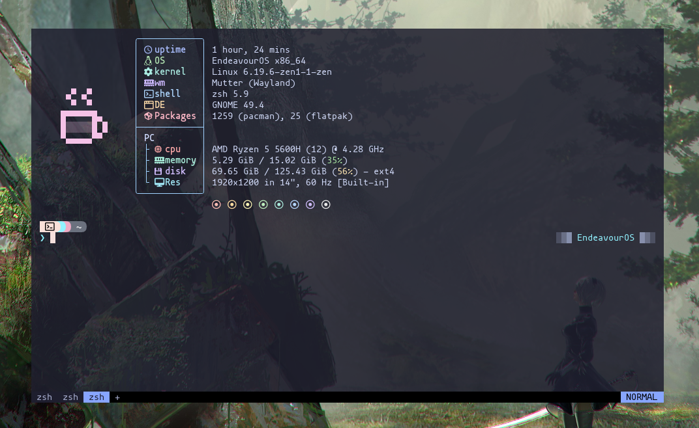
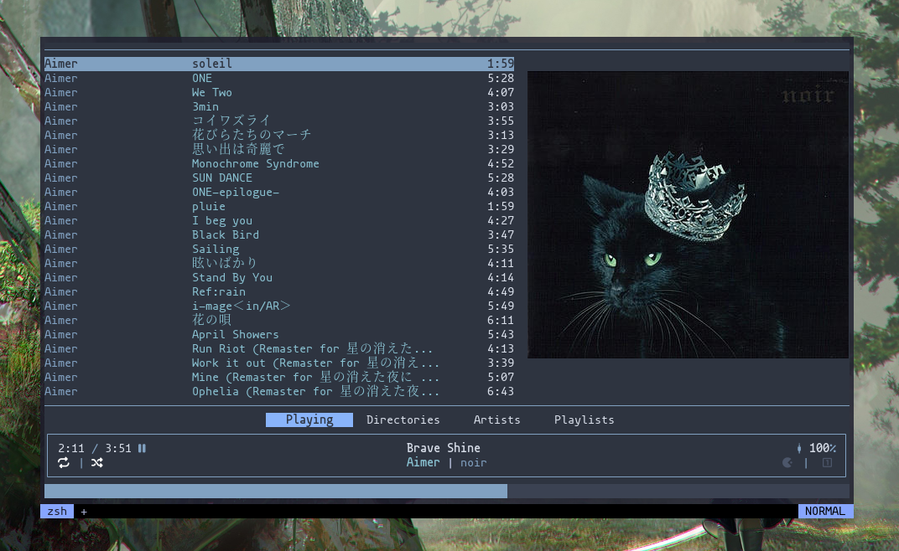
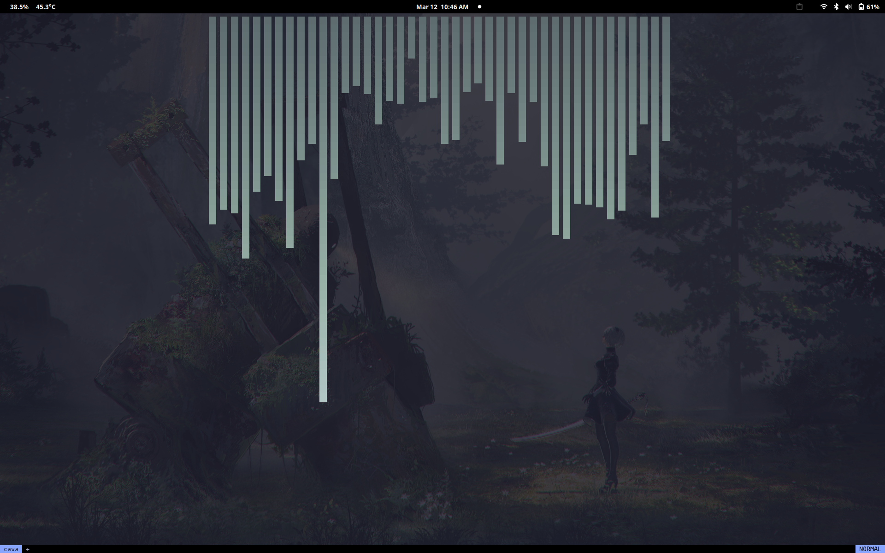
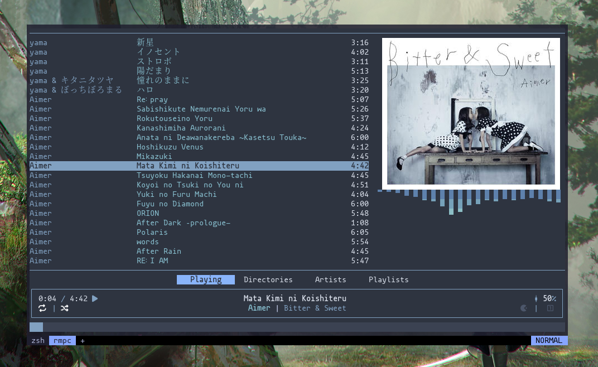
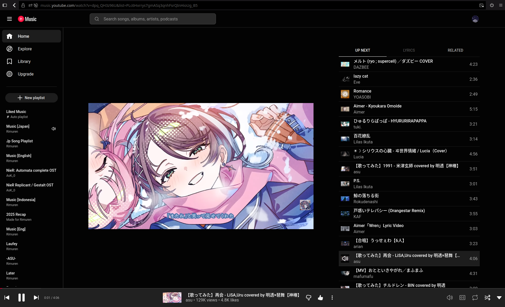
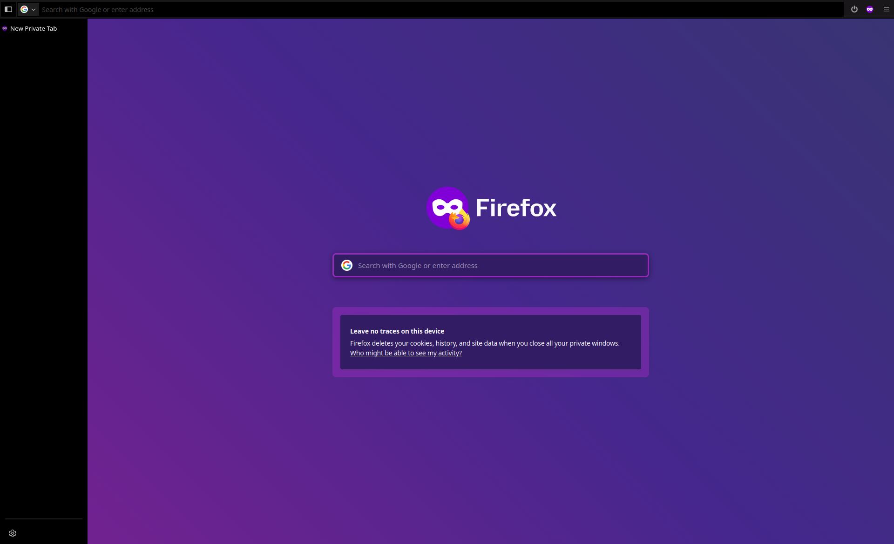

# 🗂️ Personal Dotfiles

This repository contains my personal Linux configuration files (**dotfiles**) managed with **GNU Stow**.

The goal of this setup is to make my environment:

* Reproducible
* Easy to backup
* Easy to restore on new machines
* Clean and modular
* Git-versioned

All configs are separated per application and symlinked using **stow**.

---

# 📦 Directory Structure

```
dotfiles/
├── bash/            → ~/.bashrc
├── zsh/             → ~/.config/zsh (modular zsh configuration)
├── wezterm/         → ~/.config/wezterm
├── fastfetch/       → ~/.config/fastfetch
├── starship/        → ~/.config/starship.toml
├── superfile/       → ~/.config/superfile
├── mpd/             → ~/.config/mpd
├── mpc/             → ~/.config/mpc
├── mpd-mpris/       → systemd user service config
├── rmpc/            → ~/.config/rmpc
├── firefox/         → Firefox userChrome customization
└── README.md
```

---

# ⚙️ Requirements

Before restoring the dotfiles, install the required software.

### Core

* git
* stow
* zsh
* bash

### Terminal & UI

* wezterm

* starship
* fastfetch
<details>
<summary>Preview wezterm</summary>

  

</details>

### Shell plugin dependencies

* fzf
* fd
* ripgrep
* bat
* eza

### Audio (optional)

* mpd
* mpc
* mpd-mpris
* rmpc + cava(optional)
<details>
<summary>Preview rmpc</summary>

  

</details>

<details>
<summary>Preview cava</summary>

  

</details>

<details>
<summary>Preview rmpc + cava</summary>

  

</details>

### Other tools

* superfile (file manager)
* Nerd Fonts (recommended)

Recommended fonts:

* Mononoki Nerd Font
* CaskaydiaCove Nerd Font

---

# 🚀 Installation (New Machine Setup)

## 1. Install stow

Arch:

```bash
sudo pacman -S stow git
```

Ubuntu/Debian:

```bash
sudo apt install stow git
```

---

## 2. Clone repository

```bash
git clone https://github.com/Rimuren/dotfiles.git ~/dotfiles
cd ~/dotfiles
```

---

## 3. Apply configs using stow

Apply only what you need:

```bash
stow bash
stow zsh
stow wezterm
stow starship
stow fastfetch
stow superfile
stow mpd
stow mpc
stow rmpc
stow mpd-mpris
```

---

# 🦊 Firefox Setup

Firefox profile names differ per machine.

Create symlink manually:

```bash
ln -s ~/.mozilla/firefox/chrome ~/.mozilla/firefox/<profile>/chrome
```

Find profile name:

```bash
ls ~/.mozilla/firefox | grep default
```
<details>
<summary>Preview Default</summary>

  

</details>

<details>
<summary>Preview Incognito</summary>

  

</details>

---

# 🔄 Updating Dotfiles

After editing configs:

```bash
cd ~/dotfiles
git add .
git commit -m "update: config"
git push
```

---

# 🧠 Stow Tips

If stow reports conflicts:

```bash
stow --adopt <folder>
```

This will adopt existing files into the repo safely.

To remove a config:

```bash
stow -D wezterm
```

---

# 🧪 Notes

* Install applications before running stow
* Some configs assume Nerd Fonts installed
* Wayland/X11 behavior may vary per distro
* Tested mainly on Arch Linux

---

# ✨ Philosophy

This setup focuses on:

* Minimal UI
* Terminal-first environment
* Modular configs
* Easy migration between machines

---

# 📜 License

© 2026 Rimuren — [MIT Licensed](LICENSE)