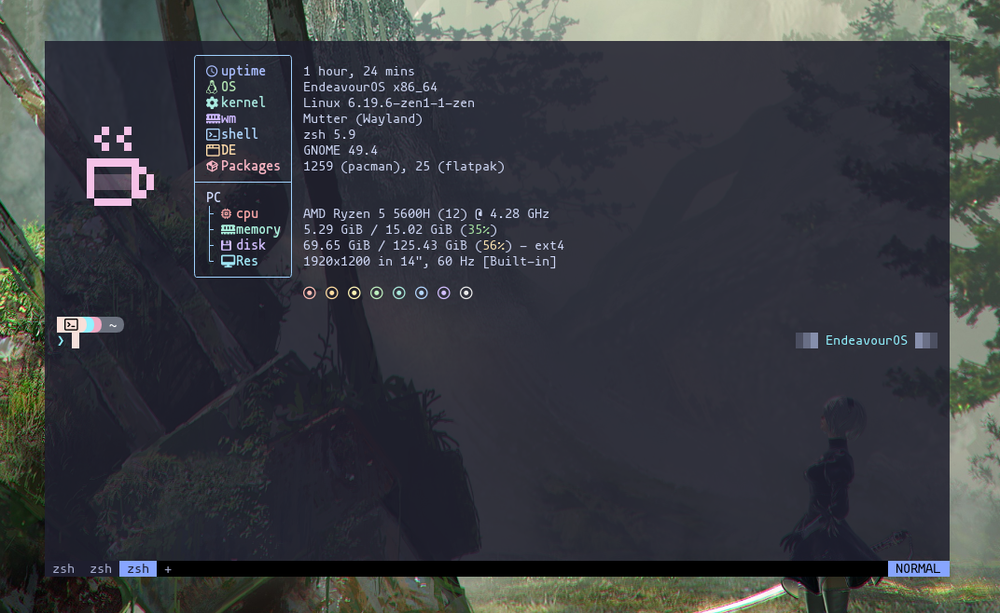
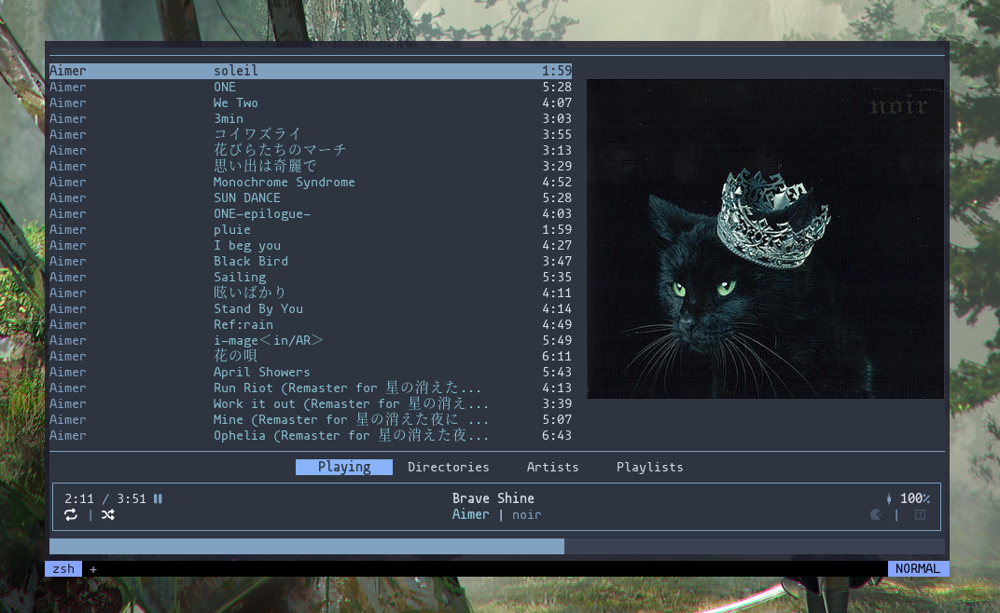
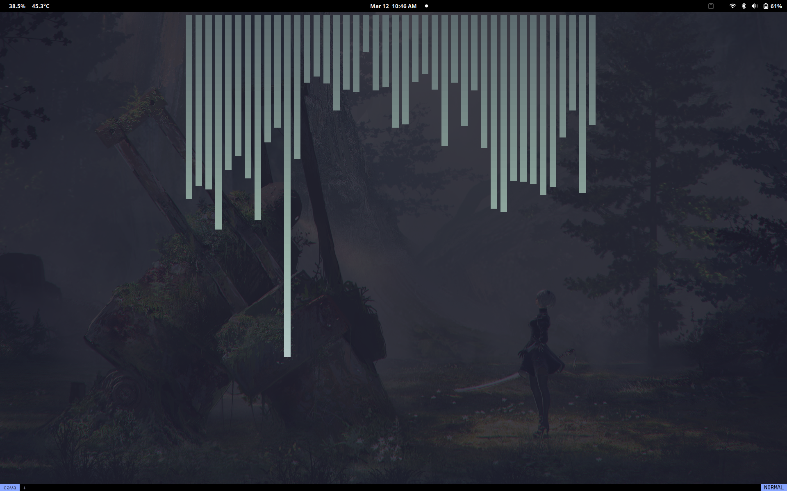
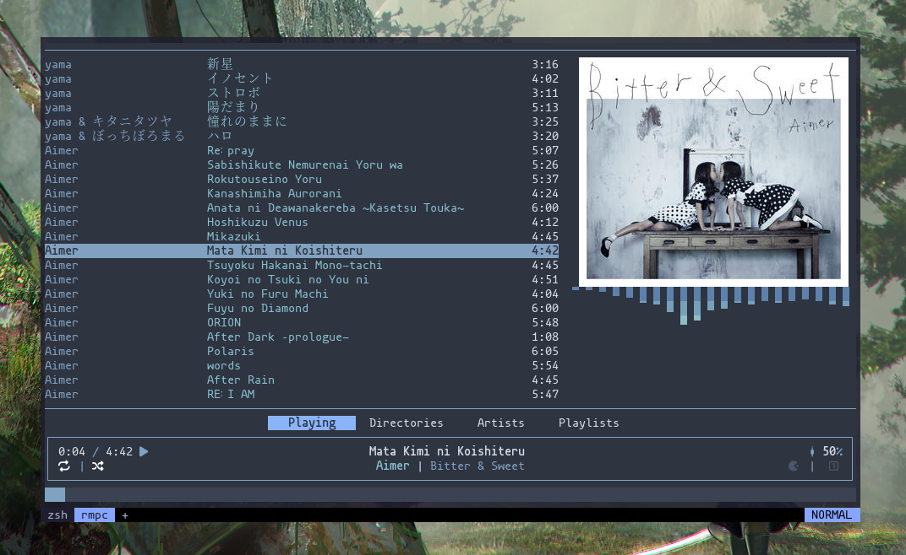

# Personal Dotfiles

Personal Linux configuration files managed with GNU Stow.

Goals: reproducible, modular, git-versioned, easy to restore on new machines.

---

## Directory Structure

```
dotfiles/
├── bash/            -> ~/.bashrc, ~/.config/bash/
├── atuin/           -> ~/.config/atuin/
├── cava/            -> ~/.config/cava/
├── fastfetch/       -> ~/.config/fastfetch/
├── fonts/           -> ~/.local/share/fonts/  (Maple Mono NF/TTF)
├── mpd/             -> ~/.config/mpd/
├── mpDris2/         -> ~/.config/mpDris2/  (systemd user service)
├── rmpc/            -> ~/.config/rmpc/
├── scripts/         -> ~/.config/scripts/  (wallctl, etc)
├── starship/        -> ~/.config/starship.toml
├── superfile/       -> ~/.config/superfile/
├── wezterm/         -> ~/.config/wezterm/
└── zsh/             -> ~/.zshrc, ~/.config/zsh/
```

---

## Requirements

### Core
- git, stow, zsh

### Terminal
- wezterm, starship, fastfetch

### Shell tools
- fzf, fd, ripgrep, bat, eza, chafa, xclip

### Audio (optional)
- mpd, mpc, rmpc, cava

### Fonts
- Maple Mono NF (included via stow)
- Maple Mono TTF (fallback)

### Other
- superfile, mise, bluetoothctl

---

## Installation

```bash
# Arch/EndeavourOS
sudo pacman -S stow git

# Ubuntu/Debian
sudo apt install stow git

git clone https://github.com/rimuren/dotfiles.git ~/dotfiles
cd ~/dotfiles
stow bash zsh atuin wezterm fastfetch starship mpd mpDris2 rmpc cava scripts fonts
fc-cache -fv      # refresh font cache
```

Or selectively:
```bash
stow zsh wezterm starship
```

---

## Stow Commands

```bash
stow <pkg>             # apply
stow -D <pkg>          # remove
stow -R <pkg>          # re-apply
stow --simulate <pkg>  # dry run

---

## Updating

```bash
cd ~/dotfiles
git add .
git commit -m "update: <pkg>"
git push
```

### Tagging a stable version

```bash
git tag v1.x.x -m "description"
git push origin v1.x.x
```

### Rollback to a tag

```bash
git checkout v1.x.x        # inspect
git checkout main           # back to latest
git reset --hard v1.x.x    # hard rollback (destructive)
```

---

## Fix Stow Conflicts

```bash
mv ~/.config/<pkg> ~/.config/<pkg>.bak
stow <pkg>
```

---

<details>
<summary>Preview wezterm</summary>



</details>

<details>
<summary>Preview rmpc</summary>



</details>

<details>
<summary>Preview cava</summary>



</details>

<details>
<summary>Preview rmpc + cava</summary>



</details>
