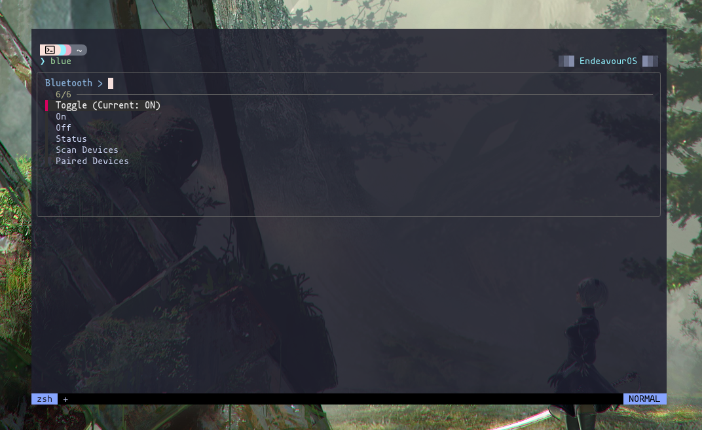
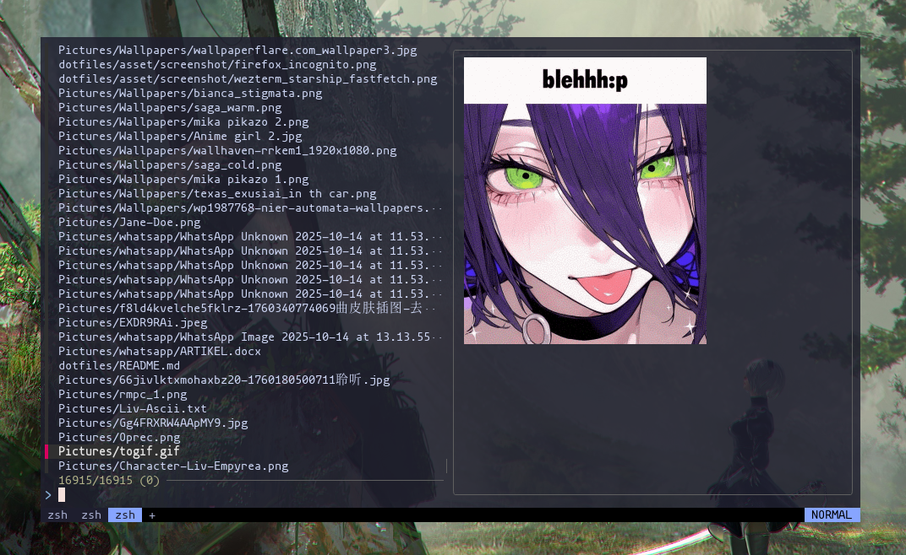
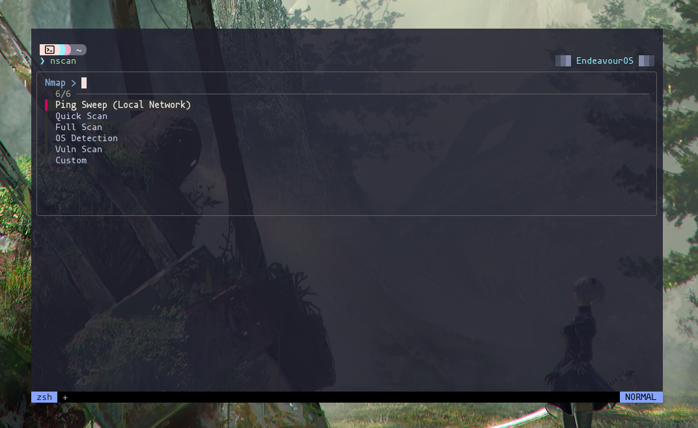
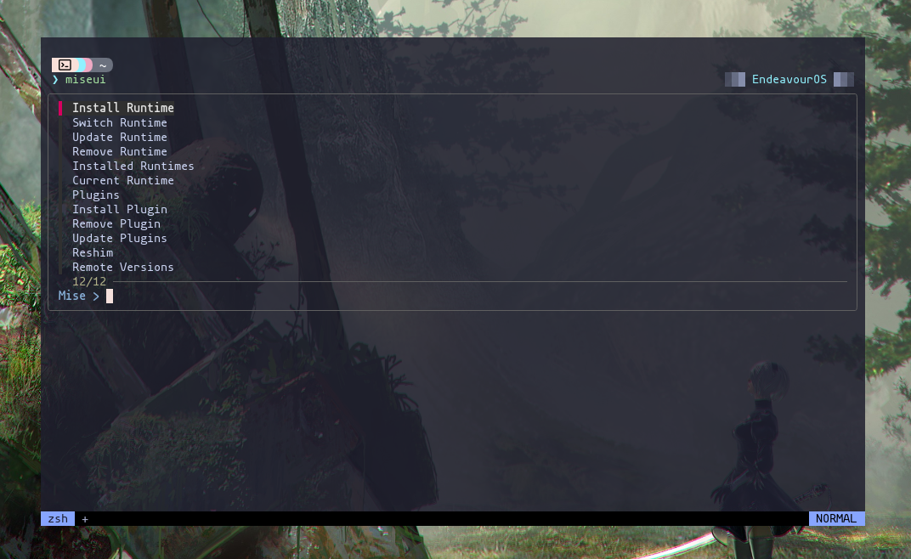

# 🐚 Zsh Configuration

This directory contains a **modular Zsh configuration** used in my personal Linux setup.

The goal of this configuration is to keep the shell:

* fast
* minimal
* modular
* easy to debug
* plugin-light

Instead of using a plugin manager, plugins are **stored directly in the repository**.

---

# 📁 Directory Structure

```
zsh/
├── .config/zsh
│
│   ├── 00-env.zsh
│   ├── 01-options.zsh
│   ├── 02-history.zsh
│   ├── 03-completion.zsh
│   ├── 04-plugins.zsh
│   ├── 05-aliases.zsh
│   ├── 06-fzf.zsh
│
│   ├── 20-helpers.zsh
│   ├── 35-ui.zsh
│
│   ├── helpers/
│   │   └── fzf.zsh
│   │
│   ├── ui/
│   │   ├── bluetooth.zsh
│   │   ├── finder.zsh
│   │   ├── nmap.zsh
│   │   └── miseui.zsh
│
│   ├── 40-prompt.zsh
│   └── 50-startup.zsh
│
└── plugins/
    └── manual/
```

---

# ⚙️ Configuration Design

The configuration follows a **numbered loading system**.

`.zshrc` loads files automatically in order:

```
00 → environment
01 → shell options
02 → history
03 → completion
04 → plugin loader
05 → aliases
06 → fzf integration
20 → helpers
35 → CLI tools
40 → prompt
50 → startup info
```

This approach makes the config:

* predictable
* easy to extend
* easy to debug

---

# 🔧 Helpers

Helper functions are stored in:

```
helpers/
```

Example:

```
helpers/fzf.zsh
```

Provides a reusable **fzf UI wrapper** used across the config.

Example usage:

```
fzfui --prompt="Select > "
```

---

# 🖥️ CLI Tools

Interactive terminal tools live in:

```
ui/
```

Included tools:

### bluetooth

Interactive Bluetooth manager using:

```
blue
```
<details>
<summary>Preview blue</summary>



</details>

### finder

File finder with preview using:

```
ff
```
<details>
<summary>Preview ff</summary>



</details>

Uses:

* fd
* bat
* chafa
* eza

### nmap helper

Interactive network scanner:

```
nscan
```
<details>
<summary>Preview nscan</summary>



</details>

### mise runtime manager

Interactive runtime manager UI:

```
miseui
```

about mise : 
```bash
https://mise.jdx.dev/getting-started.html
```
<details>
<summary>Preview miseui</summary>



</details>

Supports:

* install runtimes
* switch versions
* manage plugins
* update runtimes

---

# 🔌 Plugins

Plugins are stored locally:

```
plugins/manual
```

Included:

* fast-syntax-highlighting
* fzf-tab
* z
* zsh-autopair
* zsh-autosuggestions
* zsh-completions

This avoids dependency on external plugin managers.

---

# 🚀 Features

The shell includes:

* fast startup
* lazy-loaded plugins
* fzf-powered CLI tools
* interactive helpers
* modular configuration

---

# 🧠 Philosophy

This shell setup follows a few principles:

* **minimalism**
* **terminal-driven environment**
* **modular configuration**

The goal is to keep the shell **powerful without becoming complex**.

---

# 📜 Notes

Tested mainly on:

* Arch Linux
* Wayland environments
* Nerd Fonts enabled terminals
